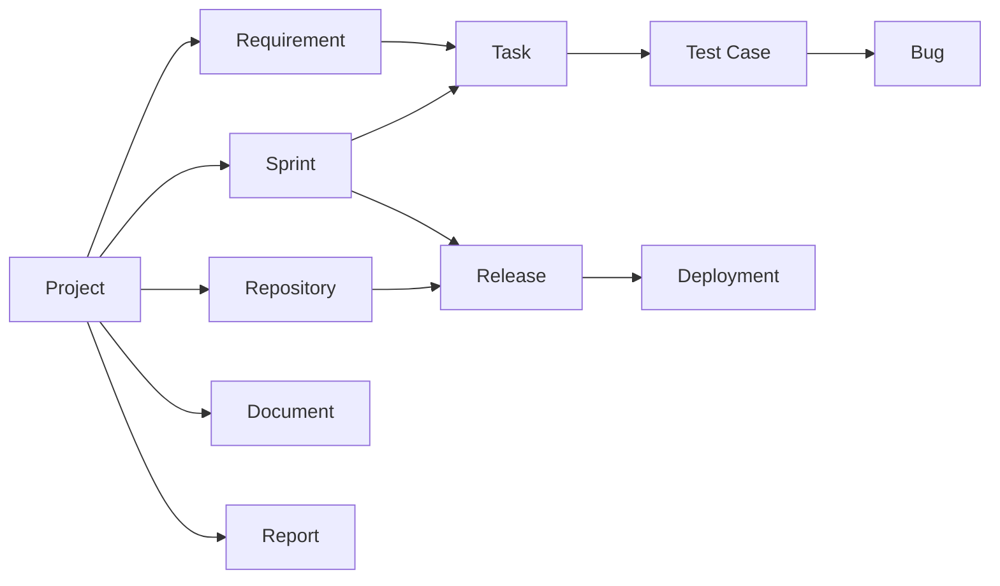

# Enterprise Software Life Cycle and Devops Management System

**NeuroForge** is a unified platform that brings the entire software development
lifecycle — requirements, sprints, tasks, testing, bugs, documentation,
reporting, source control, releases, and deployments — into a single
workspace. Instead of a team spreading its work across a project tracker, a
requirements tool, a test management system, and a deployment dashboard,
everyone works from one connected platform, scoped to their role.

It's built as a full-stack application: a Spring Boot REST API backed by
MySQL, and a React single-page frontend consuming it.

---

## Why this exists

Most engineering teams stitch together 4–6 separate tools to run a single
project — one for requirements, one for sprints/tasks, one for test cases and
bugs, one for docs, one for releases. Context gets lost at every handoff.
NeuroForge's premise is simple: **one data model, one login, one workspace**,
with every role seeing exactly the slice of it relevant to their job.

## Core modules

| Module | What it covers |
|---|---|
| **Auth & Organizations** | JWT-based login; a workspace is created by an admin, and teammates join it with an invite code |
| **Admin** | Team management, role assignment, and read-only organization-wide oversight of every resource below |
| **Projects** | The top-level container everything else belongs to |
| **Requirements** | What needs to be built, with priority and status tracking |
| **Sprints** | Time-boxed iterations a project's work is organized into |
| **Tasks** | Actionable work items, assigned to developers, scoped to a sprint and a requirement |
| **Test Cases** | QA-authored test coverage against a task |
| **Bugs** | Defects logged against a test case, tracked through severity and resolution |
| **Documents** | Structured project documentation (SRS, BRD, design docs, release notes, etc.) |
| **Reports** | Structured reporting per project (status, test, deployment, requirement reports) |
| **Repositories** | Source repositories linked to a project |
| **Releases** | Versioned releases cut from a sprint and a repository, with changelogs |
| **Deployments** | Environment-by-environment deployment tracking for a release |

## Roles & access

Every account belongs to exactly one role, enforced server-side with Spring
Security (`@PreAuthorize`) and mirrored in the frontend so people only see
what they can actually use.

| Role | What they do |
|---|---|
| **Admin** | Manages team membership and role assignment; has read-only oversight across every project, requirement, sprint, task, test case, bug, document, report, repository, release, and deployment in the organization |
| **Project Manager** | Owns the project lifecycle — creates and manages projects, sprints, and tasks; assigns developers |
| **Business Analyst** | Authors and maintains requirements for a project |
| **Developer** | Looks up tasks assigned to them (by sprint or requirement) and updates task status; views repositories, releases, and deployments |
| **QA Engineer** | Looks up a task, writes test cases against it, and logs/tracks bugs |
| **DevOps Engineer** | Manages releases and runs/tracks deployments across environments |
| **(unassigned)** | New signups start here until an admin assigns a real role — a deliberate design choice, so nobody can self-grant elevated access on signup |

## How the pieces connect



A project is the root of two parallel tracks: a **delivery track**
(requirements → sprints → tasks → test cases → bugs) and a **shipping track**
(repositories → releases → deployments) — with documents and reports
attached at the project level throughout.

## Tech stack

**Backend**
- Java, Spring Boot
- Spring Security with JWT bearer authentication
- Spring Data JPA / Hibernate
- MySQL

**Frontend**
- React 18 + Vite
- Tailwind CSS (light/dark mode)
- React Router v6
- Axios
- React Hot Toast (notifications)
- Lucide (icons)

## Key features

- **Role-based dashboards** — each role lands on a view built around what they
  actually need: a Project Manager sees a portfolio; a Developer sees task
  lookups; an Admin sees organization-wide stats and drill-down tables for
  every resource.
- **Project workspace** — once inside a project, every relevant tool
  (requirements, sprints, test cases, documents, releases, etc.) is a tab
  away, gated by role, instead of a separate page or a separate app.
- **JWT authentication**, organization-scoped signup via invite codes.
- **Light & dark mode**, responsive layout, toast notifications, and skeleton
  loading states throughout.
- **Traceable IDs** — every list surfaces the record's ID, since several
  workflows (a developer looking up their tasks, QA looking up a task to test)
  are ID-driven by design.

## Screenshots

## Authentication Module

### Create workspace and admin
![Register Organization]
### Register new user using INVITE CODE
![Register new user using INVITE_CODE]
### Login user
![Login user]

## User Profile for every user
![User profile]

## Project, Sprint, Task, Document, Repository Module

### Project Manager Dashboard
![PM Dashboard]
### Project Manager Dashboard Light Theme
![PM dashboard light theme]
### Create project
![create project]
### Project overview
![PM project overview]
### Sprint and task
![PM sprint & task]
### project section
![PM project section]
### Repository
![PM repo]
### Release and Deployment
![PM Release and Deployments]

## Requirement Module

### Business Analyst Dashboard
![BA Dashboard]
### Requirements
![BA req]
### Create Requirement
![create requirement]

## Task Module

### Developer Dashboard
![Developer dahboard]
### Developer View Task 
![Developer task]

## Test Case Module

### QA Dashboard
![QA Dashboard]
### QA Create test case from tasks
![QA create test case]
### QA test Case
![QA Test Case]

## Deployment Module

### DEVOPS Dashboard
![DevOps Dashboard]
### DEVOPS Releases
![DevOps Releases]

## Admin 

### Admin Dashboard
![Admin Dashboard]
### Team and Updating role
![Team role]
### All Projects
![All projects]
### All Requirements
![All requirements]
### All Sprints
![All sprints]
### All Tasks
![All tasks]


## Getting started

### Backend

1. Configure `src/main/resources/application.yaml` with your MySQL
   connection details and a JWT secret.
2. Run the Spring Boot application — Hibernate will create the schema
   (`ddl-auto: update`) on first run.
3. The API listens on `http://localhost:8080` by default.

### Frontend

```bash
cd frontend
npm install
npm run dev
```

Runs on `http://localhost:3000` by default — this needs to match the CORS
origin configured on the backend. Copy `.env.example` to `.env` and point
`VITE_API_BASE_URL` at your backend if it isn't on `http://localhost:8080`.

### First-time setup flow

1. Register a new workspace (creates an organization and its first Admin
   account, plus an invite code).
2. Teammates sign up using that invite code — they start with no assigned
   role.
3. The Admin assigns each teammate a role from Team & Roles, after which
   they get access to the tools that role covers.

## Roadmap

- **Refresh tokens** — access tokens are currently short-lived with no
  refresh flow, so sessions expire quickly.
- **OAuth login** — social/enterprise SSO login options.
- **Email service** — notifications and transactional email (invites,
  password resets, activity digests).

## Known design constraints

- An account holds exactly one role — there's no multi-role support today.
- A few workflows are intentionally ID-driven (e.g. a developer entering a
  sprint or requirement ID to find their tasks) where no directory/listing
  endpoint exists yet for that role. The UI surfaces the ID wherever it's
  generated so the right person can hand it off.
